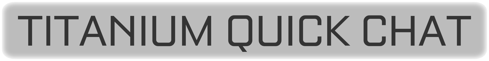
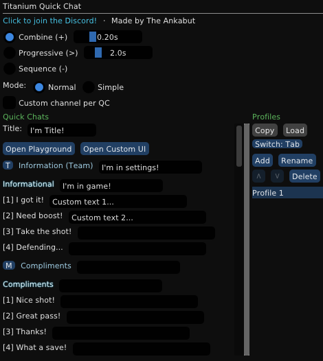
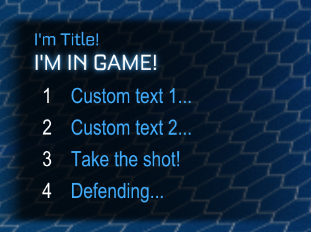
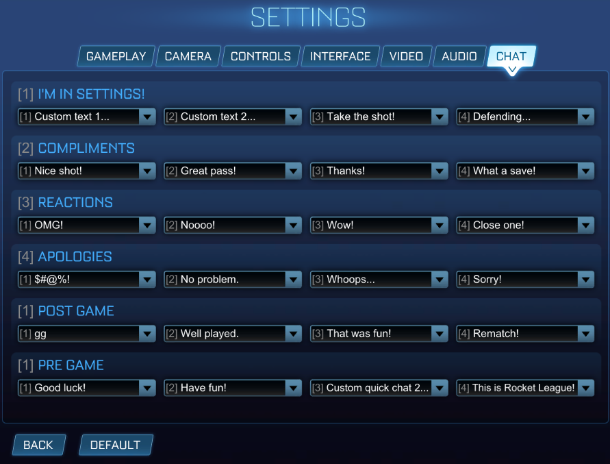
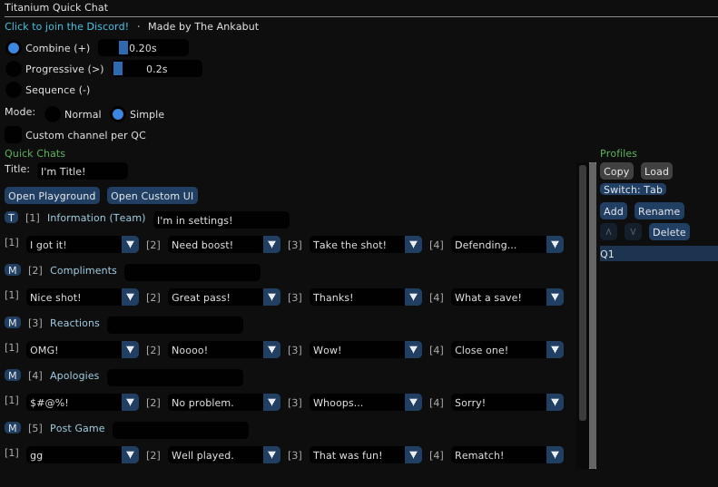
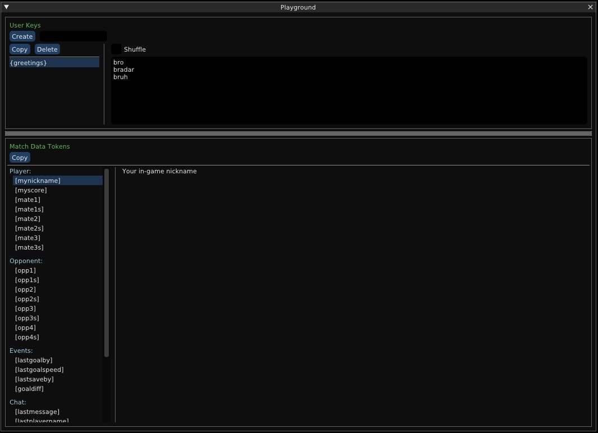
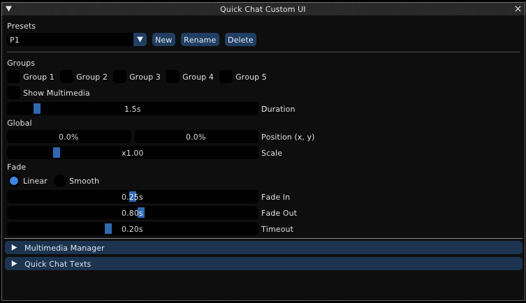

Customize Rocket League's quick chats with your own text, tokens, and profiles.

## Features

* Write custom text for any quick chat. Rename categories and the quick chat wheel title.
* Per quick chat channel override: send to Team, Match, or Party.
* Multiple profiles. Bind a key with the Switch button to cycle between them mid-game.
* Copy and Load buttons to share profile codes.

## Normal Mode

Full custom text editing per quick chat. Your text replaces the original in the settings chat page, the in-game quick chat wheel, and the wheel title. You can also set a custom channel per quick chat.



<table>
<tr>
<td width="50%"><b>In-game wheel</b></td>
<td width="50%"><b>Settings chat page</b></td>
</tr>
<tr>
<td></td>
<td></td>
</tr>
</table>

## Simple Mode

Reassign which quick chats go in each slot using dropdowns. You can rename category names in the settings chat page and set a custom channel per quick chat. Quick chats are sent as default.



## Playground

Create **User Keys** with any name you want. For example, a key called `greetings` with a list of words:

```
bro
bradar
bruh
```

Then write `Hello {greetings}!` in any quick chat text field. Each time you send it, the plugin picks a word from the list, so it sends "Hello bro!", "Hello bradar!", "Hello bruh!". Enable **Shuffle** for random order.

**Match Data Tokens** work the same way. Type them in any quick chat text field and they get replaced with live match info.

Use the **Copy** button to paste any token directly into your quick chat text fields.

<details>
<summary>See all available tokens</summary>

| Token | Description |
|---|---|
| **Player** | |
| `[mynickname]` | Your in-game nickname |
| `[myscore]` | Your current match score |
| `[mate1]` `[mate2]` `[mate3]` | Teammate name |
| `[mate1s]` `[mate2s]` `[mate3s]` | Teammate score |
| **Opponent** | |
| `[opp1]` `[opp2]` `[opp3]` `[opp4]` | Opponent name |
| `[opp1s]` `[opp2s]` `[opp3s]` `[opp4s]` | Opponent score |
| **Events** | |
| `[lastgoalby]` | Name of last goal scorer |
| `[lastgoalspeed]` | Speed of last goal |
| `[lastsaveby]` | Name of last save maker |
| `[goaldiff]` | Goal difference (+X, -X, 0) |
| **Chat** | |
| `[lastmessage]` | Last chat message received |
| `[lastplayername]` | Name of last message sender |
| **Time** | |
| `[remaining]` | Time remaining (m:ss) |
| `[overtime]` | Overtime time (+m:ss) |
| `[wait:X]` | Wait X seconds before next chunk |
| **Transform** | |
| `[upper]` | Convert text to UPPERCASE |
| `[lower]` | Convert text to lowercase |
| `[randomize]` | Random upper/lowercase mix |

</details>
<br>



## Quick Chat Custom UI

Includes the Quick Chat Custom UI plugin for full overlay customization: presets, group visibility, position, scale, fade, multimedia, and custom quick chat texts. Unlike the standalone version, the overlay here displays and sends your custom text instead of the default quick chats.



## Data Folders

Profiles are stored in:

```
%appdata%\bakkesmod\bakkesmod\data\TitaniumQuickChat\profiles\
└── MyProfile/
    └── quickchats.json
```

Custom UI presets are stored separately and shared across all profiles:

```
%appdata%\bakkesmod\bakkesmod\data\TitaniumQuickChat\QuickChatCustomUI\Presets\
└── MyPreset/
    ├── preset.json
    └── media/
```

To share a profile, use the Copy/Load buttons. To share a Custom UI preset, copy the preset folder.

## How It Works

Intercepts quick chat inputs and sends custom text through the game's chat system. Replaces the quick chat names in settings and the in-game wheel.

## Installation

1. Close Rocket League.
2. Download the ZIP from [Releases](https://github.com/TheAnkabut/TitaniumQuickChat/releases/latest).
3. Extract the zip.
4. Run `install_TitaniumQuickChat.bat`.
5. Start Rocket League.

*This plugin sends a one-time request with user ID to count unique users.*

## Discord

Questions? Join the Discord.

[](https://discord.gg/FPvkjaBPEA)

## Support

If you found this plugin useful, any support is appreciated.

<a href="https://ko-fi.com/theankabut"></a>